# Raimon: The first productivity app designed for finishing, not organizing.

The to do list is a wall. Raimon is the door.

Most tools fail at the "okay... what now?" moment. They give you 50 tasks and leave you to drown in decision paralysis. Raimon replaces the list entirely, using AI Agents to bridge the gap between your massive backlog and your actual capacity.

**One Task, Zero Noise:** No dashboards, no guilt. Just the single most important thing to do right now.

**Context Ready Execution:** It doesn't just tell you what to do, it surfaces the notes, docs, and resources you need to finish it.

**Adaptive to You:** Every day starts with a 30 second check in. Raimon recalibrates your day based on your energy, mood, and focus, not just your calendar.

**Built for Momentum:** When you're stuck, Raimon doesn't push. It guides you through a reset and generates a micro step to get you back in flow.

Stop managing your work. Start finishing it.

## Screenshots

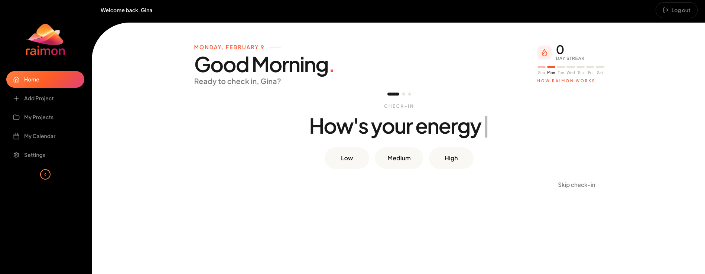

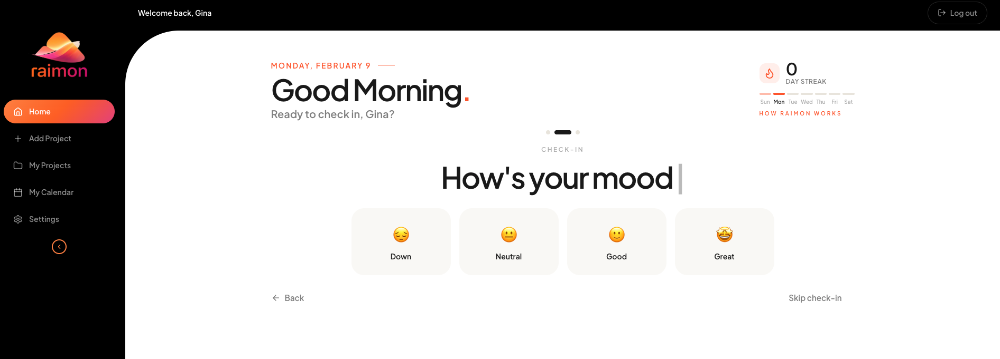

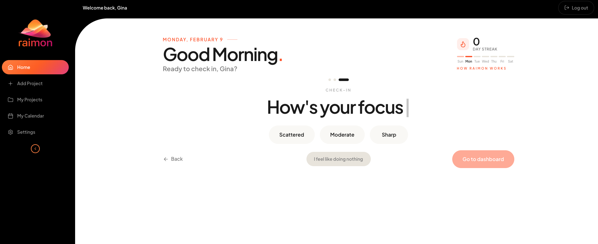

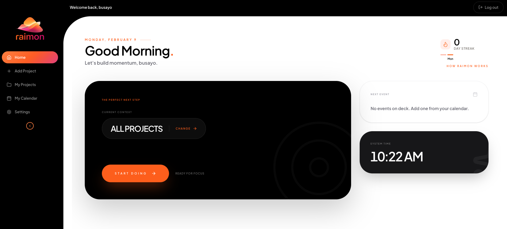

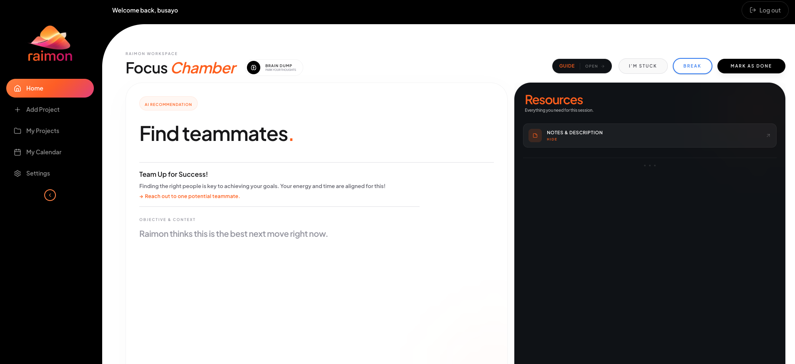

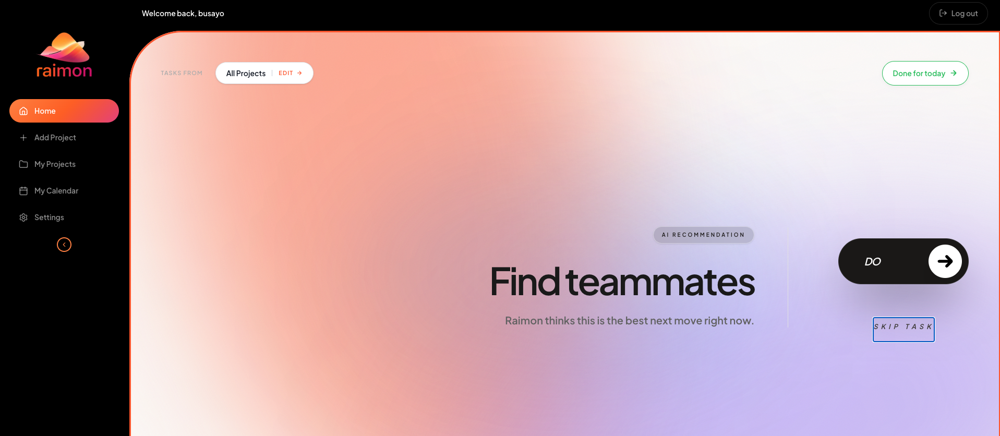

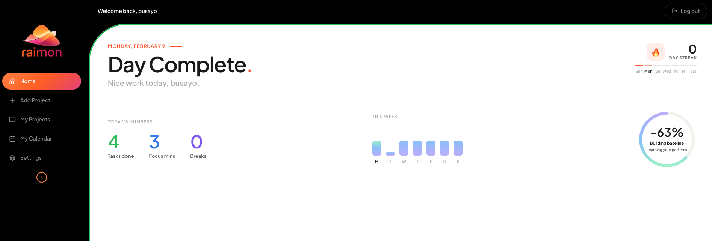

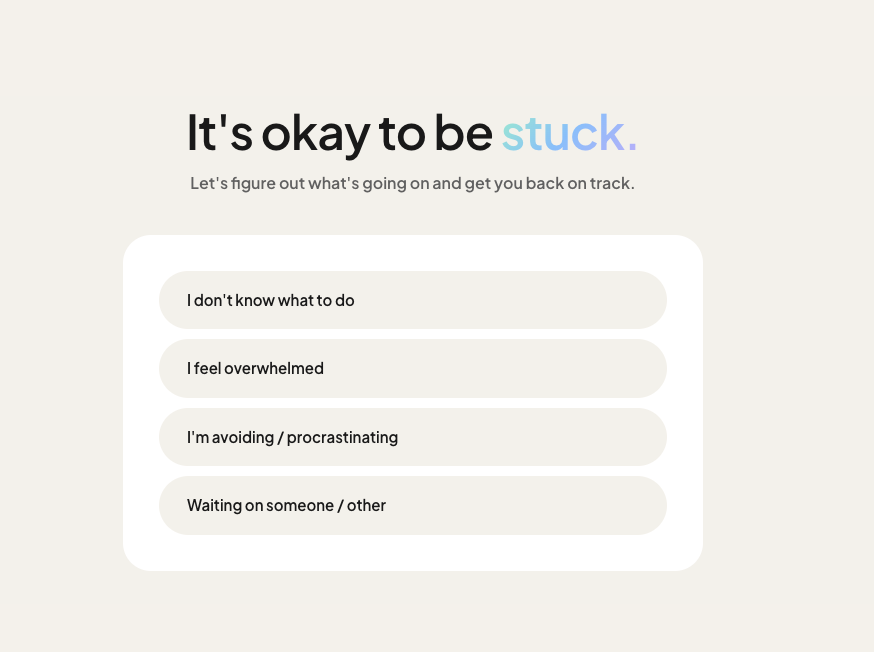

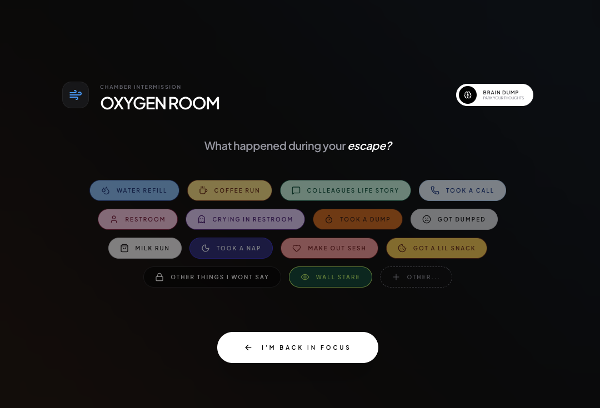

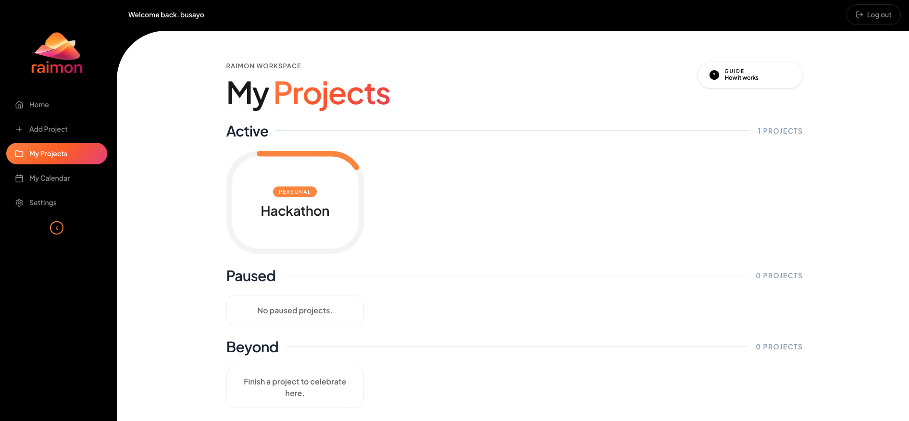

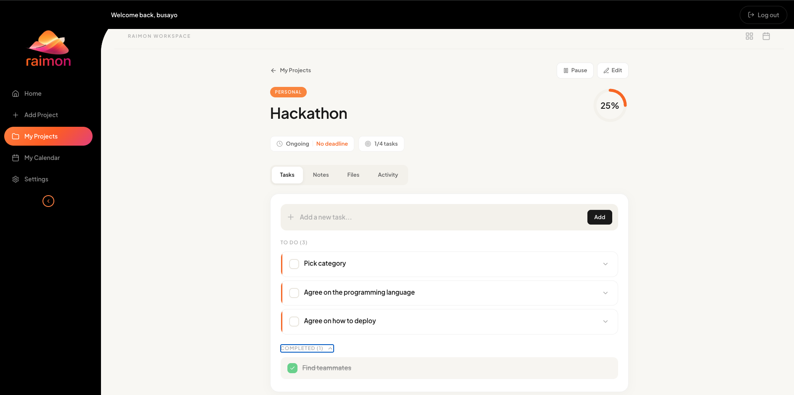
